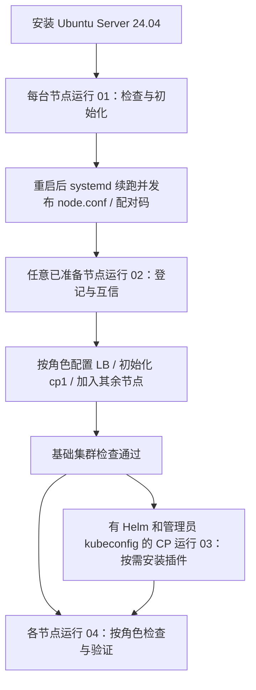

# Atlas KubeKit

**By Atlas Richie** · GitHub repository: `atlas-kubekit`

**源码版本**：以 [VERSION](VERSION) 为准；目前尚未发布版本 tag。

[](LICENSE)

面向 **Ubuntu Server 24.04 amd64** 的 Kubernetes 部署脚本集。从逐台主机初始化，到内网集中编排集群、按需安装插件，再到按节点角色巡检，使用四个按顺序编号的入口。

Interactive Bash toolkit for Kubernetes on Ubuntu 24.04: node initialization, automated HA deployment, optional add-ons, and bilingual cluster health checks.

## 目录

- [能力与适用范围](#能力与适用范围)
- [部署流程](#部署流程)
- [运行要求](#运行要求)
- [快速开始](#快速开始)
- [版本管理](#版本管理)
- [项目结构](#项目结构)
- [文档与验证记录](#文档与验证记录)
- [贡献与问题反馈](#贡献与问题反馈)
- [许可证](#许可证)

## 能力与适用范围

- **01：主机准备**。检查系统、升级依赖、配置 hostname/网络/SSH，重启后由 systemd 续跑，生成本机 `node.conf` 和一次性配对码。
- **02：集群部署**。从任意已准备节点登记其他节点，配置 hosts 与双向 SSH 互信，检查克隆身份，按 `lbN/cpN/wN` 分工安装、初始化和加入集群。
- **03：可选插件**。14 项插件的交互菜单，包括监控、日志、GitOps、备份、存储、策略、扩缩容、Gateway 和 Ingress。支持中英文。
- **04：检查与验证**。按节点角色展示连续编号菜单，检查主机、LB、控制面、运行时和插件；网络/PVC 功能检查需确认后创建临时资源。支持中英文。
- 独立数据盘可选：有明确选定的空白非系统盘时使用；没有时使用系统盘。不会自动格式化有数据或身份不明确的磁盘。
- 保存部署计划和完成标记，失败后可在修复问题后重跑；已有状态冲突时会停止，重跑不保证自动修复所有故障。

当前锁定 Kubernetes **v1.36.5**、Cilium **1.20.2**。版本变更应同时检查编排脚本与内部脚本；仅改一个变量不代表支持了新版本。插件 Chart 在安装时查询版本并供用户确认。

历史验证来自特定实验室环境，未覆盖所有云厂商、配置组合、容量和灾备场景。项目尚未发布正式版本；验证记录与当前源码的差异见各报告。外部镜像、软件包和 Chart 必须实际可达。

## 部署流程



逐步配置项、故障恢复和完整流程图见 [部署与运维指南](docs/deployment-guide.md)。

## 运行要求

| 项目 | 要求 |
|---|---|
| 系统 | Ubuntu Server 24.04、amd64、Bash 4+；其他系统未纳入支持范围 |
| 资源 | 每台至少 2 GiB 内存、系统盘至少 10 GiB 可用；CP 至少 2 vCPU。插件额外消耗需单独评估 |
| 节点命名 | `lb1/lb2/...`、`cp1/cp2/...`、`w1/w2/...`；至少包含 `lb1` 和 `cp1`，worker 可选 |
| 网络 | 每台唯一且可达的内网 IP；节点互通；当前 HAProxy/Keepalived VIP 方案要求 LB 支持同二层 VRRP/ARP |
| 管理账号 | 全节点使用相同的 SSH 管理员用户名；有 sudo 权限及控制台恢复通道 |
| 外部下载 | 能访问 Ubuntu/Kubernetes 包源、容器镜像与 Helm 仓库；项目不提供通用离线镜像包 |
| 高可用拓扑 | HA 测试示例为 2 LB + 3 CP + 3 worker；单 LB 或单 CP 部署不具备对应层高可用能力 |

云服务器可选择 `keep` 网络模式保留现有 IP。**保留 IP 不代表云网络支持当前 VIP 方案**：若云平台不允许 VRRP/ARP 漂移，需要先设计相应 API 入口方案；本工具不自动适配云负载均衡。

01 会变更主机配置、重启并禁用 SSH 密码登录；应先准备管理员公钥和控制台访问。节点间免密 sudo 与 SSH 互信的权限范围、数据盘操作和收尾要求见 [安全说明](SECURITY.md)。

## 快速开始

先通过 GitHub 下载完整仓库或源码压缩包并解压。在下载目录操作；下例的 IP 是示例，必须替换为实际节点 IP。

### 1. 逐台准备节点

01 可单独复制到每台服务器。已有 SSH 访问时，例如：

```bash
NODE_IP=10.20.1.20
scp 01-prepare-node.sh "ubuntu@$NODE_IP:~/"
```

登录目标服务器后执行；只有控制台可访问时，通过平台支持的文件传输方式放入脚本：

```bash
sudo bash ~/01-prepare-node.sh
```

按提示选择节点名、网络模式、管理员公钥等。完成重启和自动续跑后检查：

```bash
sudo bash ~/01-prepare-node.sh --status
sudo bash ~/01-prepare-node.sh --code
cat ~/.k8s-deploy/node.conf
```

其他节点也完成阶段一后再开始 02。`--config-only` 只补生成已完成节点的配置，不替代正常准备流程。

### 2. 在一个集群节点集中部署

发起节点需要 **02 与完整的 `scripts/stages/`**，不能只复制 02 单文件。可复制整个项目：

```bash
INITIATOR_IP=10.20.1.20
scp -r ./atlas-kubekit "ubuntu@$INITIATOR_IP:~/"
```

上面的目录复制命令应在项目目录的上一层执行；GitHub 解压目录可能带版本后缀，请按实际名称调整。然后在该已准备节点运行：

```bash
cd ~/atlas-kubekit
sudo bash ./02-deploy-cluster.sh
```

逐个输入其他节点配对码，输入 `done` 结束登记；核对拓扑、VIP、网段和数据盘计划后确认部署。数量不限于示例 8 台。脚本会分发内部脚本并按角色执行。

出错时先看日志、修复原因，再从保存部署计划的原发起节点运行同一命令。不要直接删除状态目录或执行 `kubeadm reset`。

### 3. 按需安装插件

将 03 复制到具有 Helm 和管理员 kubeconfig 的控制平面节点（阶段二默认是 cp1）：

```bash
sudo bash ~/03-install-addons.sh
# 或
sudo bash ~/03-install-addons.sh --lang zh
```

查看二级说明、确认安装并输入插件专属配置。菜单退出可用 `0`，中英文切换使用 `L`。

### 4. 按角色检查

04 可单独复制到需要检查的节点：

```bash
sudo bash ~/04-verify-cluster.sh
# 或
sudo bash ~/04-verify-cluster.sh --lang zh
```

LB 不展示 kubectl 集群菜单，worker 展示本机运行时/CNI/API 连通性，CP 在具备 kubectl 和 `admin.conf` 时展示全局检查。节点 Ready、插件 Pod Running 与业务功能、备份恢复通过是不同结论。

## 版本管理

`VERSION` 是项目版本的唯一来源，当前初始版本准备为 `0.1.0`。各 Bash 脚本内嵌自动同步的版本，单文件复制和 systemd 续跑无需读取外部版本文件。

```bash
# 查询实际脚本版本，无需 sudo
bash ./01-prepare-node.sh --version
bash ./04-verify-cluster.sh -V

# 维护者：同步 VERSION，并检查所有脚本是否一致
python3 scripts/update-version.py
python3 scripts/update-version.py --check
```

01～04 和全部内部阶段脚本均支持 `--version`/`-V`。版本不是部署成功标记，也与 Kubernetes/Cilium 版本分开；源码更新后仍需确认服务器实际副本。

递增规则、版本同步和 `vX.Y.Z` tag 发布流程见 [版本管理指南](docs/versioning.md)。版本变更和 tag 不由部署脚本自动完成。

## 项目结构

```text
atlas-kubekit/
├── 01-prepare-node.sh          # 每台节点独立运行
├── 02-deploy-cluster.sh        # 单节点集中编排
├── 03-install-addons.sh        # 可选插件菜单
├── 04-verify-cluster.sh        # 按角色巡检菜单
├── VERSION                    # 源码版本的唯一维护来源
├── scripts/
│   ├── update-version.py      # 同步脚本内嵌版本 / 检查一致性
│   └── stages/                # 02 调用与分发的 8 个内部脚本
├── docs/
│   ├── deployment-guide.md    # 完整流程、参数、恢复与验收
│   ├── versioning.md          # 版本来源、查询、递增与发布
│   ├── releasing.md           # GitHub 发布准备清单
│   └── validation/            # 历史实验室验证摘要与限制
├── .github/
│   ├── ISSUE_TEMPLATE/        # 缺陷与功能请求模板
│   └── pull_request_template.md
├── LICENSE
├── CONTRIBUTING.md
├── SECURITY.md
├── CODE_OF_CONDUCT.md
└── CHANGELOG.md
```

项目名称与仓库目录使用 **Atlas KubeKit / `atlas-kubekit`**。为兼容已部署节点，服务器状态目录、配置文件和 systemd 服务名继续使用已有 `k8s-deploy` 标识。

仓库中的内部脚本位于 `scripts/stages/`；服务器运行副本仍安装在 `/usr/local/lib/k8s-deploy/`，systemd 续跑使用该目录。02 同时兼容旧的平铺脚本包，优先读取新目录。内部脚本通常由 02 调用，具体环境参数见完整指南。

## 文档与验证记录

- [部署与运维指南](docs/deployment-guide.md)：完整流程图、逐步解释、命令、恢复与验收。
- [插件历史验证](docs/validation/addons-e2e.md)：14 项插件的核心功能验证摘要及配置边界。
- [04 历史验证](docs/validation/verify-results.md)：角色菜单、组件检查、网络/PVC/HTTP/TLS 验证摘要。
- [版本管理指南](docs/versioning.md)：VERSION、脚本内嵌版本、SemVer 和 Git tag。
- [GitHub 发布清单](docs/releasing.md)：首次发布、版本变更、仓库设置与记录要求。

原始 E2E 日志与资源快照已清理，摘要保留原验证日期、版本和限制。**目录整理后的版本尚未重新进行真实 01→04 部署回归**；这些历史报告不代表当前版本的全部路径已验证。

## 贡献与问题反馈

普通问题和建议通过仓库 Issues 提交，改动通过 Pull Request 提交。请先阅读 [贡献指南](CONTRIBUTING.md) 与 [行为准则](CODE_OF_CONDUCT.md)。安全漏洞通过 [安全说明](SECURITY.md) 指定的私密渠道报告，避免公开凭据和可利用细节。

## 许可证

项目原创脚本与文档采用 [MIT License](LICENSE)，版权署名为 `Atlas Richie`。完整许可文本见 LICENSE，标准文本来源为 [Open Source Initiative](https://opensource.org/license/mit)。通过脚本安装的第三方软件、镜像和 Chart 各自遵循上游许可证，不因本项目而变为 MIT。
