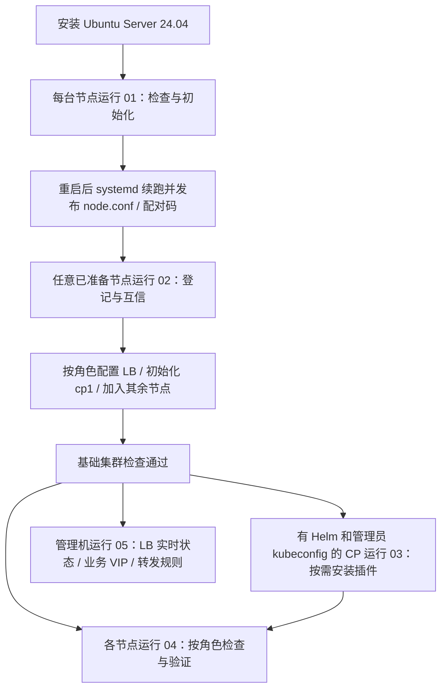

# Atlas KubeKit

**By Atlas Richie** · GitHub repository: `atlas-kubekit`

**源码版本**：`0.2.0`（待发布） · [版本来源](VERSION) · [本版变更](CHANGELOG.md#020--待发布)。

[](LICENSE)

面向 **Ubuntu Server 24.04 amd64** 的 Kubernetes 部署与运维脚本集。通过交互选项完成主机准备、内网集群编排、插件安装、巡检，以及 HAProxy/Keepalived 日常管理，减少重复的手工配置。提供 01～05 五个入口，适合逐步搭建并维护自有内网集群。

Interactive Kubernetes deployment and operations toolkit for Ubuntu 24.04: node preparation, HA cluster deployment, audits and repairs, 16 add-ons, role-based checks, and HAProxy/Keepalived management with extensible locale catalogs.

## 目录

- [能力与适用范围](#能力与适用范围)
- [0.2.0 新特性](#020-新特性)
- [部署流程](#部署流程)
- [运行要求](#运行要求)
- [快速开始](#快速开始)
  - [修复已运行的旧集群](#修复已运行的旧集群)
- [升级现有环境](#升级现有环境)
- [版本管理](#版本管理)
- [项目结构](#项目结构)
- [变更记录](CHANGELOG.md)
- [文档与验证记录](#文档与验证记录)
- [贡献与问题反馈](#贡献与问题反馈)
- [许可证](#许可证)

## 能力与适用范围

- **01：主机准备**。检查系统、升级依赖、配置 hostname/网络/SSH，重启后由 systemd 续跑，生成本机 `node.conf` 和一次性配对码。
- **02：集群部署**。从任意已准备节点登记其他节点，配置 hosts 与双向 SSH 互信，检查克隆身份，按 `lbN/cpN/wN` 分工安装、初始化和加入集群。
- **02：只读合规检查**。`--check` 按清单核对阶段一主机基线、阶段二节点依赖、SSH 主机/节点密钥唯一性及 hosts 映射；逐项报告不符合项与处理建议，不修改节点。
- **02：旧集群基线修复**。`--repair` 提供六项修复菜单、只读预览、计划确认、逐节点备份和修复后审计；不用重新执行安装流程。
- **03：可选插件**。16 项交互菜单，统一下载源与 Kubernetes/Chart 版本检查，覆盖监控、日志、GitOps、备份、NFS/Longhorn 存储、Headlamp 控制台、策略、扩缩容、Gateway 和 Ingress。
- **04：检查与验证**。按节点角色展示连续编号菜单，检查主机、LB、控制面、运行时和插件；网络/PVC 功能检查需确认后创建临时资源。
- **05：LB 运维管理（试用）**。实时查看自有 LB 服务与配置状态，管理受控业务 VIP 和 HAProxy 端口转发规则；外部 LB 单独登记。详见 [LB 运维管理器说明](docs/lb-manager.md)。
- 独立数据盘可选：已用于集群组件的挂载自动保留；其他已挂载的独立空间先询问，确认后保留原文件系统和文件，在专属子目录存放数据；空白盘按计划初始化，没有独立盘则使用系统盘。
- 外置 messageKey 语言目录提供英文、简体中文和繁体中文，并支持扩展新语言；主要交互已迁移，部分诊断与内部阶段输出仍为原有语言。
- 保存部署计划和完成标记，失败后可在修复问题后重跑；已有状态冲突时会停止，重跑不保证自动修复所有故障。

当前锁定 Kubernetes **v1.36.5**、Cilium **1.20.2**。版本变更应同时检查编排脚本与内部脚本；仅改一个变量不代表支持了新版本。插件 Chart 在安装时查询版本并供用户确认。

首发版本的历史验证来自特定实验室环境，未覆盖所有云厂商、配置组合、容量和灾备场景；验证记录与当前源码的差异见各报告。外部镜像、软件包和 Chart 必须实际可达。

## 0.2.0 新特性

本版相对于 `v0.1.0` 扩展部署后的运维能力，并补齐多项首次安装、重启续跑和重复执行问题。完整条目见 [CHANGELOG](CHANGELOG.md)。

### LB 安装、业务入口与动态管理

02 自动安装 HAProxy、Keepalived、psmisc 和 Python，配置主备优先级、共享八字符 VRRP 认证、root 所有的健康检查程序及脚本安全设置；校验候选配置后写入，并检查运行状态和开机自启动。相同配置重跑不重启已运行服务，失败时恢复配置及相关服务状态。

部署时可额外填写应用入口 VIP，例如 `10.20.1.20`。API VIP 继续负责 Kubernetes API（默认 `10.20.1.9:6443`），应用 VIP 供业务入口使用。安装器持久化 `ip_nonlocal_bind=1`，使备用节点能预先监听业务 VIP；两台 LB 完成后检查实际 VIP 单一归属。两项 VIP 当前共享一个 VRRP 实例，会一起切换。

```text
管理客户端 → API VIP:6443 → HAProxy → Kubernetes 控制平面
业务客户端 → 应用 VIP:443 → HAProxy → Gateway/Ingress NodePort → Service → Pod
```

第二条路径需要先安装 Gateway/Ingress、读取真实 Service NodePort，再用 05 创建转发规则。02 不固定某个 NodePort，也不自动生成业务 DNS、证书或上游 ACL。

05 提供每 3 秒刷新的状态视图，显示两台 LB 的服务、配置校验、地址、前后端健康和连接计数；支持业务 VIP 和 HTTP/TCP 规则的增删查。HTTP 转发可延长 WebSocket tunnel timeout，但节点故障后既有连接仍可能断开，应用需要重连机制。

| 05 管理对象 | 本版能力 |
| --- | --- |
| 自有 LB | 登记/移除目标、设置 SSH 用户；不自动创建或初始化新服务器 |
| 业务 VIP | 管理标记内的 VIP，保护现有 API VIP |
| HAProxy 规则 | 按端口及指定 VIP/通配地址转发到多个 `IPv4:PORT` 后端，HTTP/TCP 模式 |
| 配置变更 | 所有目标候选校验、备份、逐节点 reload、失败时尝试回滚 |
| 外部 LB | 独立清单登记；尚未对接设备或云厂商管理 API |

本版 05 为试用功能，尚不提供同端口域名/路径规则、TLS 终止、证书管理或多集群灾备编排。API 和应用入口可以共用这对 LB，也可以按故障隔离要求另建独立 LB。详见 [LB 管理说明](docs/lb-manager.md)。

### 审计、旧集群接管与存储保护

02 增加 `--check` 与 `--repair`，方便已运行集群核对当前主机基线。检查覆盖身份唯一性、SSH/sudo、hosts、运行时、LB 服务和实际存储路径；旧节点可通过配对码补充审计访问。修复支持逐项预览、确认、备份和修复后复查，详细命令见下方[旧集群修复](#修复已运行的旧集群)。

01/02 与初始化、加入阶段统一使用存储检测规则，识别分区、LVM、RAID 及组件当前数据目录。已有组件数据不会因默认选盘而被新挂载遮盖；对其他独立挂载空间，确认后仅使用专属子目录，保留现有文件系统和文件。

### 插件、下载源与兼容性

| 编号 | 插件 | 用途 |
| --- | --- | --- |
| 1 | Headlamp | Kubernetes 可视化控制台，建议先安装 |
| 2 | Metrics Server | CPU/内存指标、kubectl top、HPA |
| 3 | cert-manager | 应用 TLS 证书管理 |
| 4 | Prometheus stack | 指标、告警、Grafana |
| 5 | Loki + Alloy | 日志存储与采集 |
| 6 | Argo CD | GitOps 应用交付 |
| 7 | External Secrets | 外部密钥同步 |
| 8 | ExternalDNS | DNS 记录同步 |
| 9 | Velero | Kubernetes 资源及持久卷备份 |
| 10 | NFS CSI | 基于现有 NFS 动态供应卷 |
| 11 | Envoy Gateway | Gateway API 应用路由 |
| 12 | Kyverno | 资源策略 |
| 13 | MetalLB | 裸机 LoadBalancer 地址通告 |
| 14 | KEDA | 事件驱动扩缩容 |
| 15 | Traefik Ingress | Ingress 请求路由 |
| 16 | Longhorn | 节点磁盘构建副本块存储 |

Headlamp 默认使用 ClusterIP 和只读权限。安装器启动及后续插件安装/升级成功后，会自动为已存在的 Headlamp 同步相关实际 CRD 的只读权限，减少逐项手补 RBAC；不因此授予写操作或 Secret 读取权限。先装其他插件也可在后装 Headlamp 时补齐。

Longhorn 安装前自动通过节点互信安装 iSCSI/NFS 等主机依赖，避开不兼容的 open-iscsi 2.1.12，并解释副本数对冗余和容量的影响。Longhorn 使用节点本地磁盘，不能替代异地备份；磁盘容量、文件系统和 Base Image 的挂载传播要求仍需确认。

全部插件共用下载源选择，覆盖 Helm HTTP/OCI Chart 和已识别的安装镜像。源选择不会自动修改已有 release，明确升级后才应用新配置；未知私有仓库保持原地址，公共代理不保证可达。版本选择结合实际 Kubernetes 版本、Chart 声明和已适配的官方兼容表，并进行预渲染检查。Envoy Proxy 镜像随所选版本自动解析，控制器就绪后可选创建指向现有 Service 的基础 HTTP Gateway/HTTPRoute。

### 语言目录与后续扩展

`locales/en.json`、`zh_cn.json`、`zh_tw.json` 保存文本，脚本通过 messageKey 读取。英文为基础回退，繁体中文可回退到简体中文、再到英文；支持自动发现语言目录和共享 Bash/Python 接口。

```bash
sudo bash ./01-prepare-node.sh --lang zh_CN
sudo bash ./02-deploy-cluster.sh --lang zh_TW
sudo bash ./03-install-addons.sh --lang en
sudo bash ./04-verify-cluster.sh --lang zh_CN
```

增加语言时新建一个 JSON，填写 `locale`、`displayName`、`fallback` 与同名 messageKey 的翻译，保留格式占位符。主要交互已迁移；02 的部分详细诊断、审计/修复程序及内部阶段仍待迁移，第三方命令输出保留原样。架构和迁移清单见 [国际化说明](docs/internationalization.md)。

## 部署流程


```mermaid
flowchart TD
    A[安装 Ubuntu Server 24.04] --> B[每台节点运行 01：检查与初始化]
    B --> C[重启后 systemd 续跑并发布 node.conf / 配对码]
    C --> D[任意已准备节点运行 02：登记与互信]
    D --> E[按角色配置 LB / 初始化 cp1 / 加入其余节点]
    E --> F[基础集群检查通过]
    F --> G[有 Helm 和管理员 kubeconfig 的 CP 运行 03：按需安装插件]
    F --> H[各节点运行 04：按角色检查与验证]
    G --> H
    F --> I[管理机运行 05：LB 实时状态 / 业务 VIP / 转发规则]
```

逐步配置项、故障恢复和完整流程图见 [部署与运维指南](docs/deployment-guide.md)。

## 运行要求

| 项目 | 要求 |
|---|---|
| 系统 | 部署目标为 Ubuntu Server 24.04、amd64、Bash 4+、Python 3；macOS 系统自带 Bash 3.2 不满足交互脚本要求 |
| 脚本包 | 保留完整仓库目录，尤其是 `locales/`、`scripts/lib/`、`scripts/stages/` 和 `scripts/lb/`，不要只传入口文件 |
| 资源 | 每台至少 2 GiB 内存、系统盘至少 10 GiB 可用；CP 至少 2 vCPU。插件额外消耗需单独评估 |
| 节点命名 | `lb1/lb2/...`、`cp1/cp2/...`、`w1/w2/...`；至少包含 `lb1` 和 `cp1`，worker 可选 |
| 网络 | 每台唯一且可达的内网 IP；节点互通；当前 HAProxy/Keepalived VIP 方案要求 LB 支持同二层 VRRP/ARP |
| 管理账号 | 全节点使用相同的 SSH 管理员用户名；有 sudo 权限及控制台恢复通道 |
| 外部下载 | 能访问 Ubuntu/Kubernetes 包源、容器镜像与 Helm 仓库；项目不提供通用离线镜像包 |
| 高可用拓扑 | HA 测试示例为 2 LB + 3 CP + 3 worker；单 LB 或单 CP 部署不具备对应层高可用能力 |

云服务器可选择 `keep` 网络模式保留现有 IP。**保留 IP 不代表云网络支持当前 VIP 方案**：若云平台不允许 VRRP/ARP 漂移，需要先设计相应 API 入口方案；本工具不自动适配云负载均衡。

01 会变更主机配置、重启并禁用 SSH 密码登录；应先准备管理员公钥和控制台访问。节点间免密 sudo 与 SSH 互信的权限范围、数据盘操作和收尾要求见 [安全说明](SECURITY.md)。

## 快速开始

先通过 GitHub 下载完整仓库或源码压缩包并解压。在下载目录操作；下例的 IP 是示例，必须替换为实际节点 IP。

### 1. 逐台准备节点

将完整项目复制到每台服务器，保留相对目录。以下命令在本机仓库根目录执行：

```bash
NODE_IP=10.20.1.20
ssh "ubuntu@$NODE_IP" 'mkdir -p ~/deploy'
scp -r ./. "ubuntu@$NODE_IP:~/deploy/"
```

登录目标服务器后执行；只有控制台可访问时，通过平台支持的文件传输方式放入脚本：

```bash
cd ~/deploy
sudo bash ./01-prepare-node.sh
```

首次运行先选择界面语言，再按提示选择节点名、网络模式、管理员公钥等。也可用 `--lang en`、`--lang zh_CN` 或 `--lang zh_TW` 指定语言。完成重启和自动续跑后检查：

```bash
sudo bash ./01-prepare-node.sh --status
sudo bash ./01-prepare-node.sh --code
cat ~/.k8s-deploy/node.conf
```

其他节点也完成阶段一后再开始 02。`--config-only` 只补生成已完成节点的配置，不替代正常准备流程。

### 2. 在一个集群节点集中部署

发起节点需要完整脚本包。其他节点完成准备后，在其中一个节点的项目目录执行：

```bash
cd ~/deploy
sudo bash ./02-deploy-cluster.sh
```

逐个输入其他节点配对码，输入 `done` 结束登记；核对拓扑、VIP、网段和数据盘计划后确认部署。数量不限于示例 8 台。脚本会分发内部脚本并按角色执行。

出错时先看日志、修复原因，再从保存部署计划的原发起节点运行同一命令。不要直接删除状态目录或执行 `kubeadm reset`。

已有集群可先从可 SSH 访问的节点运行只读检查。显式传入**完整**清单；命令在发起节点执行，需能以管理员私钥 SSH 登录所有节点：

```bash
sudo bash ./02-deploy-cluster.sh --check \
  --user ubuntu --identity /home/ubuntu/.ssh/id_ed25519 \
  --node lb1=10.20.1.20 --node lb2=10.20.1.21 \
  --node cp1=10.20.1.22 --node cp2=10.20.1.23 --node cp3=10.20.1.24 \
  --node w1=10.20.1.25 --node w2=10.20.1.26 --node w3=10.20.1.27
```

旧集群没有节点私钥或互信时，先复用配对码建立审计访问。在其他节点的 SSH 终端或控制台运行以下命令；它使用当前 hostname、IP 和 SSH 账号，不进入系统初始化、网络或数据盘交互，也不生成阶段一完成标记：

```bash
sudo bash ./01-prepare-node.sh --pair
```

在发起节点运行 `sudo bash ./02-deploy-cluster.sh --check --pair`，一次粘贴其他节点的配对码，每行一个，最后输入 `done`。脚本解析码中的 IP，通过与阶段二部署相同的协议追加审计公钥授权、验证 SSH 主机公钥，并自动登记本机。专用审计私钥仅留在发起节点，节点清单和经过认证的主机公钥保存到登录账号的 `~/.k8s-deploy/audit-nodes.conf` 和 `audit-known_hosts`。后续直接运行 `--check` 即可；`--check --sudo` 会询问一次远程 sudo 密码，用于读取需要 root 的设置，不保存密码或修改 sudoers。

省略 `--node` 时，优先复用已保存的审计清单，其次尝试本机 `/etc/hosts`；没有可用清单时显示一次输入提示，可以整块粘贴 `NAME=IPv4`、`NAME IPv4`、`NAME:IPv4` 或配对码，以空行或 `done` 结束。`--check --pair` 可强制重新登记。只有明确输入配对码时才建立新的 SSH 授权；普通 `--check` 读取配置并报告问题，本机直接采集，缺少远程身份时明确标记未验证。缺失的显式 `--identity` 路径会报错。报告不会用已有部署状态标记代替实时检查，会区分失败与未验证，并逐项列出建议处理方式。

#### 修复已运行的旧集群

从保存审计清单的集群节点运行，先预览全部修复项目：

```bash
cd ~/deploy
sudo bash ./02-deploy-cluster.sh --repair --sudo --items all --dry-run
```

应用时进入菜单选择，或使用 `--items all` 选全部六项：

```bash
sudo bash ./02-deploy-cluster.sh --repair --sudo
# 或：已核对预览计划后选择全部六项
sudo bash ./02-deploy-cluster.sh --repair --sudo --items all
```

| 菜单 | 修复项目 | 行为 |
| --- | --- | --- |
| 1 | `hosts` | 修复全节点的 hostname/内网 IP 映射，保留无关别名 |
| 2 | `node-keys` | 补齐独立节点密钥、分发公钥、配置并验证 SSH 互信；保留管理员授权 |
| 3 | `ssh` | 验证管理员访问后配置密钥登录和禁止 root 登录；新连接失败恢复原策略 |
| 4 | `sudo` | 为指定 SSH 用户配置 root `NOPASSWD:ALL`；这项会扩大无密码自动化权限 |
| 5 | `adopt` | 验证旧节点基线，登记真实 node.conf 并写入验证来源，最后标记 ready |
| 6 | `host-keys` | 轮换重复的 SSH 主机密钥、更新集群 known_hosts，并显示新指纹 |

默认菜单选择 `1,2,3,4,5`，不包含主机密钥轮换；你的报告若有重复主机密钥，旧节点注册将保持阻止状态，需明确选择第 6 项或 `all`。也可用 `--items hosts,node-keys` 只修部分项目。实际修改要求终端输入 `REPAIR`；第 6 项额外要求输入 `ROTATE HOST KEYS`。

每台节点的原文件保存在 root-only 的 `/var/lib/k8s-deploy/repair-backups/`。完成项保留，错误时停止，解决原因后可以重跑。修复不会重新安装 Kubernetes、改网络/机器 ID、重启节点或更换数据挂载。`adopt` 要求唯一身份、可用互信、SSH/sudo 基线、运行时和存储全部满足；不足时不会新建 ready 来掩盖问题。已有正确注册配置会保留。

**选择主机密钥轮换后，Mac/DBX 等外部客户端可能报告指纹变化。** 核对控制台或脚本输出的新指纹后，定向更新客户端的 known_hosts；集群节点无法替你修改管理员电脑上的记录。修复前保留当前会话及控制台入口。

详见 [旧集群修复流程与恢复边界](docs/deployment-guide.md#02-旧集群基线修复) 和 [修复设计与验证边界](docs/validation/repair-design.md)。

### 3. 按需安装插件

在具有 Helm 和管理员 kubeconfig 的控制平面节点（阶段二默认是 cp1），进入完整项目目录：

```bash
cd ~/deploy
sudo bash ./03-install-addons.sh
# 或
sudo bash ./03-install-addons.sh --lang zh_CN
```

启动后依次**选择语言 → 选择下载源 → 进入插件主菜单**。指定 `--lang en/zh` 时跳过语言选择，仍会先展示下载源菜单。下载源菜单显示已保存的选择，回车或输入 `0` 保留并继续；首次默认为官方源。之后选择插件，查看二级说明、确认安装并输入插件专属配置。主菜单 `0` 退出，`L` 切换语言，`S` 随时更换下载源。当前源供全部 16 项插件的后续安装/升级共用，并保存在登录账号的 `~/.k8s-deploy/addon-sources.json`。

可选官方源（默认）、DaoCloud、1Panel + DaoCloud、Google Docker Hub 缓存和自定义企业代理。国内可先尝试 DaoCloud；公共源可能缺包或限流，不能保证当前网络可达。1Panel 方案明确组合 DaoCloud 代理其他仓库；Google 只缓存部分 Docker Hub 内容，不是全插件镜像站。

普通 Helm 索引/Chart 包和 OCI Chart 统一进入下载策略；全部插件使用所选 Chart 的配套镜像，安装时处理常见公开仓库镜像、Helm 钩子镜像配置及 Envoy 数据面配置。Envoy Proxy 镜像根据所选版本的官方发布建议、Chart 默认值或对应版本源码自动确定，不再要求输入镜像坐标；额外 values 仍可覆盖。所选源失败不会静默切回官方。现有 release 不会仅因切源就被修改，需单独确认升级；未知私有仓库、后续业务镜像和运行时配置保持独立。所有插件的版本及镜像处理需要 `python3-yaml`，缺少时会询问是否通过 Ubuntu apt 安装。03 需要与 `locales/` 和 `scripts/lib/` 一起复制，才能使用语言菜单和 messageKey。

Headlamp 排在插件菜单首位，建议先安装。它默认只通过 ClusterIP 提供服务，并绑定 Kubernetes `view` 只读角色；访问前请配置身份认证方式或使用 `kubectl port-forward`。安装器会在启动时及每个插件成功安装/升级后，检查 Headlamp 是否存在，并按已部署插件实际注册的 CRD 资源自动同步 `get/list/watch` 只读授权，不授予写权限或读取 Secret。Longhorn 安装前会通过阶段二的 SSH mesh 在全部 Kubernetes 节点自动安装并启用 `open-iscsi`/`iscsid`、加载并持久化 `iscsi_tcp`，并补齐主机工具和 NFSv4 客户端；脚本会避开 Longhorn 标记不兼容的 open-iscsi 2.1.12。Longhorn Base Image 的挂载传播、磁盘容量和文件系统适用性仍需按实际节点确认。如果已有默认 StorageClass，03 不会自动替换。安装 Envoy Gateway 时，控制器就绪后可选创建基础 HTTP Gateway/HTTPRoute 指向现有 Service；TLS、DNS、认证与可达的外部负载均衡仍需按环境配置。

**全部插件统一按实际 Kubernetes 版本筛选版本**：读取服务端 `/version`，按 Chart 的 `kubeVersion` 和已适配的官方兼容表推荐稳定候选，Envoy 也不再固定默认版本。手动选择后重新检查实际下载包，并按当前集群版本/API 预渲染。明确不匹配时停止；缺少兼容依据时标记 `UNKNOWN` 并默认拒绝继续。`CHART` 只表示符合 Chart 声明，不代表完整上游测试；额外 values 的自定义镜像仍须单独核对。详细范围见[版本与 Kubernetes 匹配](docs/addon-download-sources.md#全部插件的版本与-kubernetes-匹配)。

来源地址、覆盖范围、自定义代理的路径约定及排错见 [插件下载源](docs/addon-download-sources.md)。

### 4. 按角色检查

在需要检查的节点进入完整项目目录：

```bash
cd ~/deploy
sudo bash ./04-verify-cluster.sh
# 或
sudo bash ./04-verify-cluster.sh --lang zh_CN
```

LB 不展示 kubectl 集群菜单，worker 展示本机运行时/CNI/API 连通性，CP 在具备 kubectl 和 `admin.conf` 时展示全局检查。节点 Ready、插件 Pod Running 与业务功能、备份恢复通过是不同结论。

### 5. 管理现有 LB

在能通过 SSH 登录所有 LB 的管理机上，以持有 SSH 私钥的普通账号运行：

```bash
cd ~/deploy
bash ./05-manage-lb.sh
```

首次进入“自有 LB 节点清单”，设置 SSH 用户并登记实际节点，例如 `lb1=10.20.1.12 lb2=10.20.1.19`。目标节点必须已安装并配置 LB、支持免密 SSH 和 `sudo -n`。选择“实时状态”核对服务与配置，再登记业务 VIP、创建转发规则。

本机清单位于 `~/.config/atlas-kubekit/lb-manager.json`；远端受管业务状态位于 `/etc/atlas-kubekit/lb-manager.json`。两者用途不同。API VIP 不通过业务 VIP 菜单删除。完整操作及回退边界见 [LB 运维说明](docs/lb-manager.md)。

## 升级现有环境

1. 备份 `/var/lib/k8s-deploy/` 中的部署状态、节点清单和相关 LB 配置；若存在自动续跑任务，先确认它的状态。不要在续跑中途只替换部分文件。
2. 将完整 `0.2.0` 项目放入新的目录，查询 `--version`。旧的服务器安装副本不会随仓库自动更新。
3. 旧集群先执行 `02 --check`，需要修复时先看 `--repair --dry-run` 计划，再选择具体项目。版本升级本身不执行 kubeadm、不升级 Kubernetes 或插件，也不迁移数据。
4. LB 安装脚本重跑保留受管业务路由/VIP；状态或标记损坏时会停止，应先核对备份。生产环境仍需安排可接受短暂切换的维护窗口。
5. 插件按名称选择：Headlamp 插入首位后编号改变。已有 Helm release 默认跳过，明确选择升级才应用新版本/下载源。

与 `0.1.0` 相比，正常交互需要外置语言目录和共享运行库，旧的单文件传输方式必须调整。`0.x` 阶段的行为变化以 [CHANGELOG](CHANGELOG.md) 为准，不视为稳定版兼容承诺。

## 版本管理

`VERSION` 是项目版本的唯一来源，当前源码为待发布的 `0.2.0`。各部署入口和内部阶段 Bash 脚本内嵌自动同步的版本，版本查询无需读取外部 VERSION；正常交互仍需完整运行依赖。

```bash
# 查询实际脚本版本，无需 sudo
bash ./01-prepare-node.sh --version
bash ./04-verify-cluster.sh -V

# 维护者：同步 VERSION，并检查所有脚本是否一致
python3 scripts/update-version.py
python3 scripts/update-version.py --check
```

01～05 和全部内部阶段脚本均支持 `--version`/`-V`。版本不是部署成功标记，也与 Kubernetes/Cilium 版本分开；源码更新后仍需确认服务器实际副本。

递增规则、版本同步和 `vX.Y.Z` tag 发布流程见 [版本管理指南](docs/versioning.md)。版本变更和 tag 不由部署脚本自动完成。

## 项目结构

```text
atlas-kubekit/
├── 01-prepare-node.sh          # 每台节点独立运行
├── 02-deploy-cluster.sh        # 单节点集中编排
├── 03-install-addons.sh        # 可选插件菜单
├── 04-verify-cluster.sh        # 按角色巡检菜单
├── 05-manage-lb.sh             # 自有 HAProxy / Keepalived 运维菜单
├── VERSION                    # 源码版本的唯一维护来源
├── locales/                   # en / zh_CN / zh_TW messageKey 语言目录
├── scripts/
│   ├── lb/                     # LB 状态与受管配置协调器
│   ├── lib/                    # Bash / Python 国际化接口
│   ├── addons/                 # 插件下载源与兼容性规则源码
│   ├── sync-storage.py         # 同步 01 的存储辅助载荷
│   ├── sync-addon-sources.py   # 同步 03 的下载辅助载荷
│   ├── update-version.py      # 同步脚本内嵌版本 / 检查一致性
│   └── stages/                # 02 调用与分发的阶段脚本；含 check-cluster.py 合规检查器
├── docs/
│   ├── deployment-guide.md    # 完整流程、参数、恢复与验收
│   ├── versioning.md          # 版本来源、查询、递增与发布
│   ├── releasing.md           # GitHub 发布准备清单
│   ├── internationalization.md # 语言目录扩展与迁移清单
│   ├── lb-manager.md          # 05 运维操作与边界
│   └── validation/            # 历史实验室验证摘要与限制
├── tests/                     # LB / 编排与主机续跑回归
├── .github/
│   ├── ISSUE_TEMPLATE/        # 缺陷与功能请求模板
│   └── pull_request_template.md
├── LICENSE
├── CONTRIBUTING.md
├── SECURITY.md
├── CODE_OF_CONDUCT.md
└── CHANGELOG.md
```

项目名称与仓库目录使用 **Atlas KubeKit / `atlas-kubekit`**。为兼容已部署节点，服务器状态目录、配置文件和 systemd 服务名继续使用已有 `k8s-deploy` 标识。

仓库中的内部脚本位于 `scripts/stages/`；服务器运行副本仍安装在 `/usr/local/lib/k8s-deploy/`，systemd 续跑使用该目录。02 同时兼容旧的平铺脚本包，优先读取新目录。内部脚本通常由 02 调用，具体环境参数见完整指南。

## 文档与验证记录

- [变更记录](CHANGELOG.md)：`0.2.0` 相对于 `v0.1.0` 的新增能力、修复、升级影响和已知限制。
- [部署与运维指南](docs/deployment-guide.md)：完整流程图、逐步解释、命令、恢复与验收。
- [插件历史验证](docs/validation/addons-e2e.md)：14 项插件的核心功能验证摘要及配置边界。
- [04 历史验证](docs/validation/verify-results.md)：角色菜单、组件检查、网络/PVC/HTTP/TLS 验证摘要。
- [LB 运维管理器说明](docs/lb-manager.md)：05 号脚本试用范围、配置边界和现有集群测试步骤。
- [国际化说明](docs/internationalization.md)：messageKey、回退规则、新语言扩展及未迁移清单。
- [LB 安装回归](docs/validation/lb-installer-regression.md)：配置事务、重跑与故障恢复的自动化检查范围。
- [真实双 LB 验证](docs/validation/lb-live-e2e-20261022.md)：首次安装、路由、服务故障与重启观察记录。
- [版本管理指南](docs/versioning.md)：VERSION、脚本内嵌版本、SemVer 和 Git tag。
- [GitHub 发布清单](docs/releasing.md)：首次发布、版本变更、仓库设置与记录要求。

旧插件和 04 报告保留原验证日期与范围；2026-10-22 的 LB 记录覆盖两台 Ubuntu 24.04.5 节点的真实安装、路由、重跑、故障切换和重启，并有 15 项自动化回归记录。它来自修改版本号前的源码，**本版尚未完成全新集群的完整 01→04 回归、全部 16 插件回归或六项修复的完整故障回退验收**。本次版本/文档整理不重跑这些部署，也不把历史证据改写为整版通过。

## 贡献与问题反馈

普通问题和建议通过仓库 Issues 提交，改动通过 Pull Request 提交。请先阅读 [贡献指南](CONTRIBUTING.md) 与 [行为准则](CODE_OF_CONDUCT.md)。安全漏洞通过 [安全说明](SECURITY.md) 指定的私密渠道报告，避免公开凭据和可利用细节。

## 许可证

项目原创脚本与文档采用 [MIT License](LICENSE)，版权署名为 `Atlas Richie`。完整许可文本见 LICENSE，标准文本来源为 [Open Source Initiative](https://opensource.org/license/mit)。通过脚本安装的第三方软件、镜像和 Chart 各自遵循上游许可证，不因本项目而变为 MIT。
