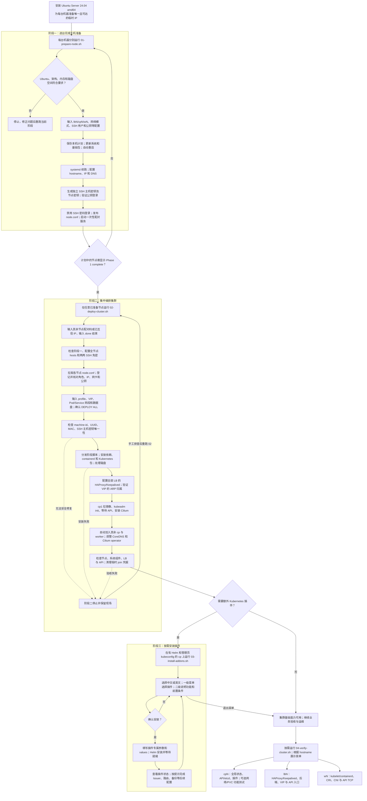

# Atlas KubeKit — Ubuntu 24.04 Kubernetes 集群部署与运维指南

## 目录

- [从新装系统到可用集群的流程图](#从新装系统到可用集群的流程图)
- [按流程图逐步说明](#按流程图逐步说明)
  - [0. 安装操作系统，准备节点和脚本](#0-安装操作系统准备节点和脚本)
  - [01-1. 系统预检与交互输入](#01-1-系统预检与交互输入)
  - [01-2. 更新、重启和自动续跑](#01-2-更新重启和自动续跑)
  - [01-3. 主机身份、网络和 SSH 基线](#01-3-主机身份网络和-ssh-基线)
  - [01-4. 发布本机清单并给出配对码](#01-4-发布本机清单并给出配对码)
  - [02-1. 从任意已准备节点登记集群](#02-1-从任意已准备节点登记集群)
  - [02-2. 建立 hosts 映射、SSH 互信并拉取阶段一清单](#02-2-建立-hosts-映射ssh-互信并拉取阶段一清单)
  - [02-3. 确认全局部署计划与节点身份](#02-3-确认全局部署计划与节点身份)
  - [02-4. 安装节点依赖、数据盘和负载均衡](#02-4-安装节点依赖数据盘和负载均衡)
  - [02-5. 初始化 cp1，加入其余节点](#02-5-初始化-cp1加入其余节点)
  - [02-6. 最终检查、凭据清理与完成边界](#02-6-最终检查凭据清理与完成边界)
  - [03-1. 进入插件菜单并查看说明](#03-1-进入插件菜单并查看说明)
  - [03-2. 收集插件参数，安装并回到菜单](#03-2-收集插件参数安装并回到菜单)
- [常用命令与恢复方式](#常用命令与恢复方式)
- [脚本清单与调用关系](#脚本清单与调用关系)
- [04：按节点角色查看与验证](#04按节点角色查看与验证)
  - [04 的验证设计与验收边界](#04-的验证设计与验收边界)
- [部署后的状态查看与验收](#部署后的状态查看与验收)
  - [1. 在 8 台机器分别检查阶段一与主机状态](#1-在-8-台机器分别检查阶段一与主机状态)
  - [2. 在阶段二发起节点查看部署记录](#2-在阶段二发起节点查看部署记录)
  - [3. 在 lb1、lb2 查看 API 入口](#3-在-lb1lb2-查看-api-入口)
  - [4. 在 cp1、cp2 或 cp3 查看整个 Kubernetes 集群](#4-在-cp1cp2-或-cp3-查看整个-kubernetes-集群)
    - [核对 CoreDNS、Cilium 和 etcd](#核对-corednscilium-和-etcd)
  - [5. 在 cp 和 worker 查看节点本机服务、磁盘](#5-在-cp-和-worker-查看节点本机服务磁盘)
  - [6. 可选：用临时 Pod 验证跨节点、Service 和 DNS](#6-可选用临时-pod-验证跨节点service-和-dns)
  - [7. 可选：验证 LB 故障切换](#7-可选验证-lb-故障切换)
  - [8. 查看按需安装的插件](#8-查看按需安装的插件)
  - [快速判定与排查](#快速判定与排查)

## 从新装系统到可用集群的流程图



图中的“停止”表示保持现场、排查后重跑相应脚本；不表示自动重置 Kubernetes、格式化现有数据盘或跳过错误。阶段一和阶段二的完成标记记录的是**当时通过的检查**，运行状态还需用本文后面的命令实时查看。

本文是完整部署与运维指南，包含部署构思、执行命令、交互参数、故障恢复和部署后的检查步骤；项目概览与快速开始见 [README](../README.md)。插件的实际功能测试证据单独保存在 [ADDONS-E2E.md](validation/addons-e2e.md)。

## 按流程图逐步说明

### 0. 安装操作系统，准备节点和脚本

为每台机器安装 Ubuntu Server 24.04 amd64，确保至少 2 GiB 内存、系统盘有至少 10 GiB 可用空间；cp 节点至少 2 vCPU。主机名固定采用 `lb1`、`lb2`、`cp1`、`cp2`、`w1` 等 `lbN/cpN/wN` 格式，由 01 脚本设置。每台机器先要有**唯一且可达的当前 IP**，以便复制脚本或从控制台操作；新克隆机若都继承母盘 IP，应先在虚拟化平台或控制台消除冲突。确认网络可访问 Ubuntu 软件源及后续 Kubernetes 镜像源。

把最新的 `01-prepare-node.sh` 放到每台服务器；阶段二发起节点还需要四个入口 `.sh` 文件和完整的 `scripts/stages/` 目录（建议复制完整项目）。脚本可以在服务器内网运行，不要求管理员的 Mac 或 Windows 电脑能直接访问全部节点。当前测试拓扑为 lb1/lb2、cp1～cp3、w1～w3；脚本的登记流程允许继续添加节点，不把数量固定为 8。

阶段脚本当前锁定 Kubernetes v1.36.5、Cilium 1.20.2。主机名中的数字从 1 开始；至少登记 `lb1` 和 `cp1`，允许没有 worker。常用输入默认地址为 `lb1=.20`、`lb2=.21`、`cp1=.22`、`cp2=.23`、`cp3=.24`、`w1=.25`、`w2=.26`、`w3=.27`，属于 `10.20.1.0/24`；API VIP 默认为 `10.20.1.9`。其他环境和新增节点应填写实际地址。所有节点的内网必须互通，LB 的 VRRP 还需要同二层网络。

### 01-1. 系统预检与交互输入

在**每台节点分别**运行 `sudo bash ~/01-prepare-node.sh`。脚本检查 Ubuntu 24.04、amd64、内存、系统盘余量，并在 cp 上检查 CPU 数。随后询问主机名、网卡、网络模式、IP、SSH 管理员用户、可选数据盘和管理员公钥来源；显示本机计划，输入 `yes` 后保存到 root 权限的 `/var/lib/k8s-deploy/node.conf`。新装机器应走正常流程，`--config-only` 只用于阶段一已经完成但缺少公开清单的恢复场景。

网络模式选 `keep` 时保留云厂商或 DHCP 已配置好的 IP、网关和 DNS，只登记当前 IP；选 `static` 时写入固定 IP、网关以及阿里云 DNS `223.5.5.5/223.6.6.6`。管理员公钥可从已有 `authorized_keys` 自动选取，也可指定服务器上的 `.pub` 文件、粘贴公钥，或选 `none` 先依赖控制台；不要输入私钥。CP/worker 的独立盘可在这里预登记，也可留给阶段二选择。

### 01-2. 更新、重启和自动续跑

01 脚本安装 systemd 续跑服务，执行 `apt update`、`full-upgrade`，安装 OpenSSH、netplan、Python 3 等基础包，然后**主动重启**。通过 SSH 运行时会断线，这是预期行为。重启后 `k8s-prepare-resume.service` 读取已保存的本机计划继续执行，无需手工重新回答问题。续跑服务等待 SSH 服务，并在首次校验前确保 `/run/sshd` 存在。网络改成静态 IP 时，应使用最终 IP 重连；状态可用 `sudo bash ~/01-prepare-node.sh --status` 查看，日志可用 `journalctl -u k8s-prepare-resume.service -b` 查看。若状态显示续跑失败，应先修复日志里的错误再运行普通 01 流程，不能用 `--config-only` 跳过未完成的步骤。

### 01-3. 主机身份、网络和 SSH 基线

续跑流程设置 hostname；在 `static` 模式生成 netplan 配置并验证 IP/默认路由，在 `keep` 模式核对登记 IP 仍在指定网卡；随后验证 DNS 解析。它为克隆节点重新生成**独立的 SSH 主机密钥**，并确保登录用户有自己的 Ed25519 密钥对。脚本先验证本机公钥登录，再禁用 SSH 密码及 root 登录并复测公钥访问，避免在没有可用密钥时直接关闭密码登录。

主机密钥用于证明服务器身份，与管理员电脑的登录私钥不同。脚本会输出新的 ED25519 主机指纹；曾连接过模板或同 IP 旧机器的 SSH 客户端，重连时应先核对新指纹，再更新该客户端的 `known_hosts`。管理员电脑使用自己的私钥登录，对应公钥必须已登记到服务器的 `authorized_keys`；选 `none` 时先通过控制台操作，不需要把服务器的节点私钥复制回电脑。

阶段一为阶段二保留登录用户的非交互 sudo 配置 `/etc/sudoers.d/90-k8s-bootstrap`。这个授权在部署结束后不会自动撤销；确认不再需要从任意节点远程重跑 02 后，应由管理员按自己的运维方式收紧。阶段一只维护本机 hostname 所需的 hosts 记录，**全体节点的主机名映射留给阶段二**。

该 sudo 配置授予所选 SSH 用户完整 sudo 权限；确认不再需要此权限时，可在全部节点自行删除该文件。脚本不存储 sudo 密码。

### 01-4. 发布本机清单并给出配对码

脚本写入登录用户的 `~/.k8s-deploy/node.conf`，包含阶段一完成标记、主机名、角色、IP/前缀、网卡、网络模式、SSH 用户/主目录、**公钥**、预登记数据盘以及 OS/架构信息；不会把私钥写入这份清单。完成标记为 `/var/lib/k8s-deploy/ready`。随后在节点内网 IP 的 TCP `25422` 启动一次性配对服务，输出将该节点 IP 与一次性密钥编码在一起的短码。

在节点控制台可用 `sudo bash ~/01-prepare-node.sh --code` 查看尚未使用的码；`--pair` 或 `-p` 会生成新码并使旧码失效。正常阶段一已经自动生成清单，不需要再跑 `--config-only`。待计划中的每台机器都显示 `Phase 1 complete`，并能通过内网 TCP 22/25422 访问后，再进入阶段二。

新配对码形如 `XXXX-XXXX-XXXX-XXXX`，输入可带或不带分隔符，大小写均可。一次性密钥只保存在 root 权限文件中，使用后失效，不写入 `cluster.conf`。旧版生成的 12 位密钥在更新 01 后运行 `--code` 可显示包含 IP 的新格式；更早的 24 位密钥仍可通过阶段二的“IP + 密钥”方式登记。

### 02-1. 从任意已准备节点登记集群

在任意一台已完成阶段一的登记节点运行 `sudo bash ~/02-deploy-cluster.sh`；本轮测试选择 lb1。首次运行持续输入其余节点的配对码，直到输入 `done`。新格式短码会被解析为目标内网 IP 和认证密钥；已具备 SSH 互信的节点也可直接输入 IP。配对服务返回节点的 SSH 主机公钥并让发起节点取得 SSH 访问，随后核对实际 hostname。登记至少包含 `lb1` 和 `cp1`；节点数量由输入决定，不要求一定是 2 LB、3 CP、3 worker。当前实现要求全部节点使用**同一个 SSH 管理员用户名**。

配对码输入会显示在终端，输错会提示重试；可到目标节点执行 `--code` 核对当前码。也可先输入内网 IP，再单独输入密钥。比如从 lb1 发起，依次输入 lb2、lb3、cp1～cp5、w1～w4 的配对码后输入 `done`，即可登记该拓扑；这里列出的主机名用于说明目标机器，登记时输入的是配对码或 IP。

### 02-2. 建立 hosts 映射、SSH 互信并拉取阶段一清单

02 先验证每台节点的阶段一完成标记、hostname、管理员公钥 SSH 和非交互 sudo。然后在**全部登记节点**的 `/etc/hosts` 写入受管理的主机名到内网 IP 映射，收集各节点自己的公钥并互相加入 `authorized_keys`。脚本逐一验证每个节点到其他每个节点的 hostname 解析及免密 SSH，成功后关闭一次性配对服务。

集群映射块放在 hosts 顶部，同时清除阶段一留下的 `127.0.1.1` 本机主机名记录，避免 hostname 优先解析到回环地址。N 台节点需验证 N×(N−1) 条节点间 SSH 链路。

SSH 网状互信就绪后，脚本通过 hostname 拉取每台机器的 `~/.k8s-deploy/node.conf`，核对角色、IP、前缀、网卡、用户主目录、公钥及预登记数据盘。这样第二阶段的角色由节点 hostname 决定，不需要在每台服务器手工运行不同安装命令。

### 02-3. 确认全局部署计划与节点身份

首次运行再询问 `standard/test` 模式、API VIP/端口、VRRP ID、Pod CIDR、Service CIDR、各 Kubernetes 节点的数据盘以及 LB 共用的 VRRP 认证值。没有预登记数据盘时，脚本只读寻找可用的空白独立盘：恰好一块时作为默认值，没有时默认 `none`，多块时必须明确选择。它列出完整计划，只有输入 `DEPLOY ALL` 才开始后续安装和可能的**空白数据盘初始化**。计划以 root 权限保存在发起节点 `/var/lib/k8s-deploy/cluster.conf`，用于失败后的继续执行；不要公开该文件全文。

确认后，02 检查每台机器的 `machine-id`、`product_uuid`、网卡 MAC 和 SSH 主机密钥是否唯一。重复的 `machine-id` 会在没有 kubeadm 状态时修复并安排重启续跑；旧克隆机重复的 SSH 主机密钥会重新生成并更新集群信任。`product_uuid` 或 MAC 冲突需先在虚拟化平台解决，脚本会停止而不会伪造主机身份。

空白盘必须是非系统盘，且未分区、未挂载、无磁盘签名；有数据或分区的盘不会自动选中或格式化。已保存的部署计划重跑时保留原选盘，不因后来新增磁盘而自动改写。`standard` 和 `test` 都要求 cp 至少 2 vCPU、所有节点至少 2 GiB 内存；`test` 仅降低独立盘容量门槛，适合一次性安装验证。

### 02-4. 安装节点依赖、数据盘和负载均衡

02 将 `setup-k8s-node.sh` 等阶段脚本分发到对应节点。CP/worker 安装基础包与时间同步服务，关闭 swap，配置内核模块和 sysctl，安装并检查 containerd 的 `SystemdCgroup=true`，再安装并锁定 kubeadm/kubelet/kubectl 版本。选独立盘时先核对其不是系统盘、未分区/未挂载/无签名，再按计划格式化和挂载：cp 用 `/var/lib/etcd`，worker 用 `/os_data`。`standard` 模式要求 cp 独立盘至少 90 GiB、worker 至少 500 GiB；一次性 `test` 模式把独立盘最低值降为 20 GiB。

CP 和 worker 都可以选择 `none` 使用系统盘；CP 的 etcd 数据仍位于 `/var/lib/etcd`，只是该目录不再是独立挂载点。02 将保存的选盘结果传给初始化与加入脚本：选 `none` 时检查系统盘余量，并拒绝 `/var/lib/etcd` 的残留挂载或 fstab 记录；选独立盘时必须先完成挂载，且该盘不能与系统盘同源。etcd 开始写入后不能直接改换挂载方式，必须另行规划数据迁移与恢复。

系统盘至少 10 GiB 可用空间只是安装前的最低余量，实际容量和 I/O 性能需按负载规划。worker 的 `/os_data` 不会自动接管 containerd 镜像或 kubelet 数据，也不等于已经提供 Kubernetes 持久卷。

全部 LB 安装 HAProxy/Keepalived：HAProxy 将 API TCP `6443` 转发给登记的 CP；Keepalived 在 LB 之间维护同一个 VIP。使用 VIP 前，02 从每个 Kubernetes 节点多次刷新 ARP，要求 VIP 的 MAC 属于登记 LB，避免误用已被其他设备占用的地址。VIP 应在网络管理层预留；当前测试 VIP 是 `10.20.1.9`。

### 02-5. 初始化 cp1，加入其余节点

cp1 经 containerd 镜像代理拉取 Kubernetes 镜像，执行 `kubeadm init`，使用 VIP 作为 control plane endpoint；02 轮询等待 API 就绪，然后通过 Helm 安装 Cilium 并等待 cp1 `Ready`。只有确实需要加入其他节点时，cp1 才生成短期 control-plane/worker join 凭据；脚本按节点角色分发相应凭据，依次加入其余 cp 和 worker，并等待每个节点 `Ready`。每加入一个 cp，便调整 CoreDNS；最后将 CoreDNS 分散到已登记的 CP，并按 CP 数量调整 Cilium operator 副本。

已有且正确的安装步骤会被重跑跳过；若某个节点有不确定的 kubeadm 半成品状态，02 会停止，**不会自动执行 `kubeadm reset`**。因此出现失败时先看错误和节点状态，再从发起节点重跑，不要直接清空集群。

### 02-6. 最终检查、凭据清理与完成边界

02 的最后一关检查全部 Kubernetes 节点 `Ready`、Cilium/CoreDNS rollout、etcd Pod 数量和运行状态、CoreDNS 在 CP 间的分布、LB 服务 active 以及 VIP API `/readyz`。通过后撤销短期 join token，清理各节点的 join 文件，写入 `/var/lib/k8s-deploy/cluster-ready`，并从部署计划中移除 VRRP 认证值。`sudo bash ~/02-deploy-cluster.sh --status` 可查看部署完成标记。

此时得到的是**基础 Kubernetes 集群**。阶段二没有自动部署 StorageClass、应用入口、监控、日志或异机 etcd 备份；节点 `Ready` 也不能替代业务 Pod 网络与数据恢复验收。文末列出这些能力的检查方法。

阶段二中途失败时，已保存的计划会在发起节点下次运行时读取；脚本会重新检查阶段一文件和节点身份，按当前环境继续处理。若失败发生在首次确认计划之前，已配对成功的节点可在重新登记时直接输入 IP。对于不确定的 kubeadm 状态、IP 冲突、磁盘内容或 UUID/MAC 冲突，先处理具体故障，不能把“可重跑”理解为“任何错误都会自动修复”。

hosts 和 SSH 互信在输入 `DEPLOY ALL` 之前配置；该确认授权后续软件部署及选定空白盘的初始化。`cluster.conf` 属于 root、权限为 0600，保存拓扑、导入的网卡/用户主目录/公钥、选盘结果及部署期间的 VRRP 认证值；成功后移除认证值，重跑时重新询问。发起节点因修复重复 `machine-id` 而重启时，由 `k8s-cluster-resume.service` 接续。当前八节点测试结果不能代表所有可变节点数量、网络环境及纯净系统组合均已完成现场验收。

### 03-1. 进入插件菜单并查看说明

基础集群就绪后，在具备 Helm 3、kubectl 和管理员 kubeconfig 的 CP 上运行 `sudo bash ~/03-install-addons.sh`；阶段二默认在 cp1 安装 Helm。03 先检查交互终端，然后选择语言：`1` 为英文（默认），`2` 为中文；也可通过 `--lang en` 或 `--lang zh` 直接指定。检查 API `/readyz` 后展示 14 个可选插件：Metrics Server、cert-manager、Prometheus 监控栈、Loki + Alloy、Argo CD、External Secrets Operator、ExternalDNS、Velero、NFS CSI、Envoy Gateway、Kyverno、MetalLB、KEDA、Traefik Ingress。主菜单输入 `L/l` 可重新选择语言，输入编号进入该插件的二级说明页，了解用途、前置服务、可配置项和安装后的后续动作；默认不安装，确认继续后才询问参数。输入 `0` 退出菜单。

语言切换覆盖菜单、插件说明、确认、配置问题和脚本自身的提示，仅对本次运行生效。确认支持 `yes/y`、`no/n` 和 `是/否`；配置值如 `none`、`NodePort`、`Retain` 仍需按原值输入。Helm/kubectl 原生输出保留工具自身语言；VNC/本地控制台缺少中文字库时使用英文。

### 03-2. 收集插件参数，安装并回到菜单

03 根据选项询问专属参数。例如，Metrics Server 询问副本和 kubelet TLS；监控栈询问保留期、StorageClass/PVC 与 Grafana 管理员密码；NFS CSI 需要现成的 NFS server/export；MetalLB 需要已预留且避开 API VIP 的地址池；Loki/Alloy、ExternalDNS、Velero 要求用户提供含外部服务配置的 Helm values 文件。脚本不猜测云厂商凭据或对象存储。已有 Helm release 会先询问是否升级，默认跳过；安装使用 Helm 并等待就绪，完成或取消后回到菜单继续选择。

脚本使用官方 Helm 仓库或 OCI chart，查询稳定版本并在安装前显示版本供修改，安装采用 `helm upgrade --install --wait --atomic`。CRD 升级仍需遵循对应插件的官方升级说明。必填的 values 文件须使用节点上的绝对路径；包含云密钥的文件应放在受保护路径，不提交到代码仓库。Grafana 密码可隐藏输入或由脚本生成。

MetalLB 的 Layer 2 地址池适用于支持 ARP 的自建网络，例如 Proxmox；云 VPC 一般应使用云平台负载均衡。地址池不能与 DHCP、节点或 API VIP 重叠。Traefik 的 Service 默认 NodePort，可选 LoadBalancer（需要 MetalLB 或云负载均衡）或 ClusterIP，不复用 API VIP，也不自动设为默认 IngressClass。业务 Ingress 应指定 `spec.ingressClassName: traefik`。监控未配置 StorageClass 时使用临时存储，重建 Pod 会丢失历史数据。

插件安装只代表控制器或相关组件就绪，通常还需单独创建业务资源：如 cert-manager 的 Issuer、Envoy Gateway 的 Gateway/Route、Traefik 的 Ingress、External Secrets 的 SecretStore、KEDA 的 ScaledObject、Velero 的备份计划。03 不会自动完成这些与业务环境有关的配置。社区版 ingress-nginx 已于 2026 年 3 月退役，因此菜单提供仍在维护的 Traefik 来处理传统 `Ingress` 资源；它不保证兼容 nginx 专属注解。

03 菜单的每个选项对应的安装边界如下；“后续动作”不会因为安装 Helm release 而自动完成：

| 菜单项 | 03 实际安装及询问 | 安装后仍需处理 |
|---|---|---|
| Metrics Server | CPU/内存指标 API；询问副本数、是否在测试环境跳过 kubelet TLS 校验、可选 values | 用 `kubectl top` 验证，再为业务配置 HPA |
| cert-manager | 控制器、Webhook 和 CRD；可选 values | 创建 Issuer/ClusterIssuer、证书和 DNS/CA 凭据 |
| Prometheus 监控栈 | Prometheus、Alertmanager、Grafana 等；询问保留期、PVC/StorageClass、Grafana 密码 | 配置告警接收、访问入口和持久化；无 StorageClass 时指标为临时数据 |
| Loki + Alloy | 分别安装日志存储和采集组件；两份 Helm values 为必填 | 准备对象存储方案、日志管道并验证查询 |
| Argo CD | 安装 GitOps 控制器与内部 UI Service；可选 values | 接入 Git/Helm 仓库、RBAC 和外部访问 |
| External Secrets | 安装 operator；可选 values | 创建 SecretStore/ClusterSecretStore 和云密钥访问方式 |
| ExternalDNS | 询问 DNS provider、域名、TXT owner ID、来源与必填凭据 values；默认仅新增/更新记录 | 验证提供商权限及记录同步范围 |
| Velero | 用必填 values 安装备份组件和 provider 插件配置 | 创建备份计划并测试恢复；etcd 快照需另做 |
| NFS CSI | 询问已有 NFS server/export、StorageClass 名与回收策略 | 验证 PVC 创建、跨节点挂载和数据回收 |
| Envoy Gateway | 安装 Gateway API 入口控制器；可选 values | 创建 GatewayClass、Gateway、Route 及对外访问地址 |
| Kyverno | 安装策略引擎；可选 values | 从审计策略开始，再逐步决定执行策略 |
| MetalLB | 安装控制器，创建 Layer 2 地址池和广播；询问已预留 IP 范围 | 验证 LoadBalancer Service 获得地址；云 VPC 应用云负载均衡 |
| KEDA | 安装事件驱动扩缩容控制器与 CRD；可选 values | 给业务创建 ScaledObject/ScaledJob 和认证配置 |
| Traefik Ingress | 安装传统 `Ingress` 控制器；询问副本数、Service 类型和可选 values；不自动设为默认 IngressClass | 为业务 Ingress 设置 `spec.ingressClassName: traefik`，并将外部流量导向其 Service |

## 常用命令与恢复方式

以下假定 01～04 入口已放到登录用户主目录，02 同目录下还有 `scripts/stages/`；也可在完整项目目录中运行入口脚本。服务器安装副本仍位于 `/usr/local/lib/k8s-deploy/`，02 兼容旧平铺包。01 在每台机器运行；02 在持有部署计划的发起节点运行；03 在具备 Helm 和管理员 kubeconfig 的 cp 上运行。

| 场景 | 命令 | 行为与前提 |
|---|---|---|
| 新节点准备或修复后续跑 | `sudo bash ~/01-prepare-node.sh` | 首次交互保存计划；已有计划则继续处理 |
| 查看阶段一状态 | `sudo bash ~/01-prepare-node.sh --status` | 查看完成或续跑状态 |
| 仅补生成公开清单 | `sudo bash ~/01-prepare-node.sh --config-only` | 必须已有 root 本机配置和阶段一完成标记 |
| 查看当前未使用配对码 | `sudo bash ~/01-prepare-node.sh --code` | 只显示，不换码 |
| 重新配对 | `sudo bash ~/01-prepare-node.sh --pair` | 生成新码，启动登记服务，旧码失效；简写 `-p` |
| 为旧节点启用登记服务 | `sudo bash ~/01-prepare-node.sh --enable-enrollment` | 已完成阶段一、但未启用登记服务时使用 |
| 开始或继续集中部署 | `sudo bash ~/02-deploy-cluster.sh` | 初次登记；重跑读取已保存的部署计划 |
| 查看阶段二状态 | `sudo bash ~/02-deploy-cluster.sh --status` | 查看部署完成标记，再做实时检查 |
| 按需安装插件 | `sudo bash ~/03-install-addons.sh` | 先选语言，再进入插件菜单 |
| 指定插件菜单语言 | `sudo bash ~/03-install-addons.sh --lang en` 或 `--lang zh` | 英文适合 VNC/本地控制台；主菜单 `L/l` 可切换 |

`--config-only` 读取 `/var/lib/k8s-deploy/node.conf`，核对当前 hostname、IP 和节点公钥，只生成或更新登录用户的 `~/.k8s-deploy/node.conf` 并标记 `PHASE1_READY=1`。它不重跑安装、不修改网络/SSH/hosts、不创建密钥或续跑服务、不重启。旧参数 `--publish` 是同义写法；未完成阶段一时应修复正常流程，而不是使用该参数绕过检查。

重启后若阶段一未完成，先查看日志：

```bash
sudo journalctl -u k8s-prepare-resume.service -b -n 100 --no-pager
```

旧版脚本曾在精简版 Ubuntu 首次重启后因 `/run/sshd` 缺失而失败。确认日志是 `Missing privilege separation directory: /run/sshd` 时，可在控制台创建目录，更新主目录的 01 脚本后继续原计划：

```bash
sudo install -d -m 755 /run/sshd
sudo bash ~/01-prepare-node.sh
```

新版会创建该目录并等待 SSH 服务。其他错误按具体日志处理；续跑成功后再用 `--status` 和 `--code` 查看结果。02 出错后也应先处理具体原因，再从原发起节点重跑，保留计划与现场，不自动重置集群。

## 脚本清单与调用关系

部署按 **01 → 02 → 03（可选）** 执行，之后使用 **04** 日常查看与验证。阶段二发起节点须有四个入口 `.sh` 文件和完整的 `scripts/stages/` 目录（建议复制完整项目）；阶段二内部脚本位于 `scripts/stages/`，由 02 按角色分发和调用，04 则复制到需要检查的节点运行。

| 文件 | 用途 |
|---|---|
| [01-prepare-node.sh](../01-prepare-node.sh) | 每台节点的系统升级、网络与 SSH 配置、重启续跑、清单和配对码 |
| [02-deploy-cluster.sh](../02-deploy-cluster.sh) | 集中登记、互信、身份检查、部署编排和最终检查 |
| [03-install-addons.sh](../03-install-addons.sh) | 基础集群就绪后的可选插件交互菜单 |
| [04-verify-cluster.sh](../04-verify-cluster.sh) | 按 hostname 和本机工具展示巡检、健康检查及可选功能验证菜单 |
| [setup-k8s-node.sh](../scripts/stages/setup-k8s-node.sh) | containerd、数据盘和 Kubernetes 包安装 |
| [setup-lb.sh](../scripts/stages/setup-lb.sh) | HAProxy 与 Keepalived 配置 |
| [configure-registry-mirror.sh](../scripts/stages/configure-registry-mirror.sh) | containerd 镜像代理配置 |
| [init-cluster.sh](../scripts/stages/init-cluster.sh) | cp1 的 kubeadm 初始化 |
| [install-cilium.sh](../scripts/stages/install-cilium.sh) | Cilium 安装与就绪检查 |
| [create-join-credentials.sh](../scripts/stages/create-join-credentials.sh) | 生成短期 control-plane 和 worker join 凭据 |
| [join-nodes.sh](../scripts/stages/join-nodes.sh) | 执行经过校验的 join 命令 |
| [configure-coredns-ha.sh](../scripts/stages/configure-coredns-ha.sh) | CoreDNS 副本数与跨控制面调度 |

## 04：按节点角色查看与验证

将 `04-verify-cluster.sh` 复制到要检查的服务器，运行：

```bash
sudo bash ~/04-verify-cluster.sh
sudo bash ~/04-verify-cluster.sh --lang zh  # 中文；默认英文适合 VNC
sudo bash ~/04-verify-cluster.sh --lang en
```

启动语言菜单与 03 保持一致，单独列出 `Language / 语言`、`1) English` 和 `2) 中文 (Chinese)`：`1` 为英文（默认，适合 VNC），`2` 为中文；指定 `--lang en/zh` 可跳过启动选择。主菜单输入 `L/l` 可随时切换，切换时回车保留当前语言，语言选择仅对本次运行有效。菜单、配置问题、确认、故障切换指引和脚本自己的结果/错误提示均随语言切换，确认支持 `yes/y`、`no/n`、`是/否`。kubectl、systemctl、curl 等工具的原生输出、资源名称和配置值保留原样。

脚本用 `hostname -s` 识别 `cpN`、`lbN`、`wN`，只展示该角色可用的菜单。CP 的集群菜单还要求本机有 kubectl 和 `/etc/kubernetes/admin.conf`；缺少时仍可查看主机与服务、排查基础问题。LB 不显示 kubectl 菜单，worker 不要求管理员 kubeconfig。可用检查项从 `1` 开始连续编号，隐藏项目不占序号；编号按当前显示的菜单映射到检查功能，换节点时应按菜单标题选择。输入 `0` 退出，输入 `L/l` 切换语言。

| 范围 | 验证内容 | 操作边界 |
|---|---|---|
| 全部节点 | 系统资源、时间、IP/路由/DNS、阶段标记、主机指纹、hosts 与本机到其他节点的 SSH、服务日志、磁盘挂载 | 查看本机；SSH 使用阶段一管理员用户及节点密钥，严格核对已登记主机指纹 |
| CP | 节点条件、Pod/工作负载、API、Cilium、CoreDNS、etcd 健康与成员、证书到期、Service/入口/策略、存储、事件、指标、RBAC | 默认只读，命令失败继续显示并返回菜单 |
| CP 插件二级菜单 | 与 03 相同的 14 个插件，查看已安装组件和相关业务资源 | CRD 不存在时显示未安装/不可用；资源存在不等于功能 E2E 通过 |
| LB | HAProxy/Keepalived 服务、配置校验、后端 TCP 连通、VIP 所在网卡、API readyz、故障切换操作指引 | 不自动停止服务；故障切换另行手工演练 |
| worker | kubelet/containerd、CRI 容器和镜像、本机 CNI、到 API 的 TCP 连通 | 只读；不显示 CP 全局查询 |
| CP 可选功能测试 | 两个指定节点之间 Pod IP、Service 与 DNS；PVC 写入后重建 Pod 读取；用户指定 HTTP/TLS 入口的响应 | 创建临时资源前明确确认；使用唯一测试命名空间，退出时仅清理本次资源 |

网络测试要求两个不同且 Ready 的 Kubernetes 节点；用户选择镜像，镜像源、准入策略和 NetworkPolicy 都可能影响结果。脚本从测试 Pod 的 `resolv.conf` 提取集群域名，再查询完整 Service 域名，不依赖 BusyBox 对短域名的搜索行为。

PVC 测试要求选择已有 StorageClass、容量、镜像及有写权限的容器 UID/GID（默认 `1000/1000`，fsGroup 使用相同 GID）。需要按 NFS export 或其他存储的实际权限填写，fsGroup 不保证可以改变服务端权限；测试的写入断言成功后才删除 writer 并创建 reader。此项验证供给、挂载及重建 Pod 后的数据保留，不等于跨节点存储、快照或备份恢复验收。清理 PVC 时 `Retain` 策略可能留下 PV/存储端数据，脚本会提示处理，不直接删除存储端文件。

HTTP 测试询问 URL、可选 Host 请求头和期望状态码；HTTPS 始终验证证书，可填写自建 CA 的绝对文件路径。可选目标 IPv4 通过 `curl --resolve` 覆盖连接地址，保留 URL 的域名/SNI，适合尚未发布 DNS 的入口验证。仅设置 Host 请求头不会改变 TLS SNI。测试不携带登录凭据，状态码匹配不代表响应内容或业务行为正确。

“只读巡检汇总”仅收集该角色的状态，不自动执行临时资源测试或故障切换。每项显示命令失败数；命令成功表示查询/指定断言成功，不能解释为所有集群能力通过。日志为现场显示，不自动保存；不要将可能含业务信息的日志整段公开。

### 04 的验证设计与验收边界

| 风险 | 验证方法 | 必须满足的断言 |
|---|---|---|
| 角色菜单误显示 | 模拟 cp/lb/worker/未知 hostname、缺少工具或 kubeconfig | 隐藏不适用项目；手工输入隐藏编号也不执行 |
| 失败导致退出或误报 | 模拟 API 超时、命令失败、CRD 缺失 | 可返回菜单；失败明确显示，未执行不记为通过 |
| 配置/密钥泄漏 | 代码审阅及命令输出核对 | 不 source 部署配置，不输出私钥、Secret 数据或完整 cluster.conf |
| 临时测试污染 | 审阅创建/清理范围，现场执行确认与中断路径 | 仅删除本次随机命名空间；未创建时不删除任何现有资源 |
| 状态被误当成功能 | 区分查询、健康断言和真实网络/PVC 请求 | 未执行的功能、跨节点存储、故障/备份恢复保持未验证 |

命令依据：[kubectl get](https://kubernetes.io/docs/reference/kubectl/generated/kubectl_get/)、[Service 调试](https://kubernetes.io/docs/tasks/debug/debug-application/debug-service/)、[etcd 集群状态检查](https://etcd.io/docs/v3.6/tasks/operator/how-to-check-cluster-status/)。

2026-10-02 已完成角色菜单/失败恢复模拟验证，以及 cp1、lb1、w1 的现场检查；真实网络、PVC 重建持久化及 HTTP/TLS 正反向测试的证据和限制见 [04 验证记录](validation/verify-results.md)。不自动进行 LB 故障切换或备份恢复，也不将 14 个插件的状态查询算作重新完成插件 E2E。

## 部署后的状态查看与验收

以下提供从阶段一到集群、负载均衡及应用网络的检查步骤。除“临时业务网络测试”和“LB 故障切换”两节外，命令均为只读检查。插件的安装及功能验证记录见 [ADDONS-E2E.md](validation/addons-e2e.md)；etcd 异机快照与恢复演练仍需单独规划。

当前克隆测试环境为 Ubuntu 24.04.5 LTS、Kubernetes v1.36.5、Cilium 1.20.2：

| 角色 | 主机名与内网 IP | 到哪里查看 |
|---|---|---|
| 负载均衡 | lb1 `.20`、lb2 `.21` | 各自查看 HAProxy、Keepalived、VIP |
| 控制面 | cp1 `.22`、cp2 `.23`、cp3 `.24` | 任一 cp 用 `kubectl` 查看全局；各自查看 kubelet、etcd |
| 工作节点 | w1 `.25`、w2 `.26`、w3 `.27` | 从 cp 查看节点和 Pod；各自查看 kubelet、containerd |

这些尾号均属于 `10.20.1.0/24`；API VIP 为 `10.20.1.9:6443`。未来在其他环境部署时，应以阶段二登记的实际 IP、VIP、节点数和角色为准。**LB 不会出现在 `kubectl get nodes` 中**：当前应看到 6 个 Kubernetes 节点，而不是 8 个。

### 1. 在 8 台机器分别检查阶段一与主机状态

在每台机器本地执行。`01-prepare-node.sh` 若仍在登录用户目录，可直接用第一条查看；即使脚本不在，也可检查完成标记。

```bash
sudo bash ~/01-prepare-node.sh --status  # 预期：Phase 1 complete
sudo test -f /var/lib/k8s-deploy/ready && echo 'Phase 1 marker present'
hostname
ip -br -4 addr
getent hosts lb1 lb2 cp1 cp2 cp3 w1 w2 w3
systemctl is-active ssh
timedatectl status
```

预期：本机 hostname 与分配角色一致，IP 与登记计划一致；8 个名称解析到各自内网 IP；SSH 正在运行；系统时间已同步。阶段一登录用户的 `~/.k8s-deploy/node.conf` 应存在，可只查看非敏感字段：

```bash
grep -E '^(PHASE1_READY|NAME|ROLE|IP|OS_VERSION|ARCH)=' ~/.k8s-deploy/node.conf
```

在任一已登记节点上，可逐个检查其他节点的免密 SSH；当前测试集群的名称如下，其他拓扑请替换：

```bash
for n in lb1 lb2 cp1 cp2 cp3 w1 w2 w3; do
  if [ "$n" = "$(hostname)" ]; then continue; fi
  ssh -o BatchMode=yes -o ConnectTimeout=5 "$n" hostname || echo "SSH failed: $n"
done
```

### 2. 在阶段二发起节点查看部署记录

本轮从 lb1 发起。在发起节点执行：

```bash
sudo bash ~/02-deploy-cluster.sh --status  # 预期：Deployment complete
sudo test -f /var/lib/k8s-deploy/cluster-ready && echo 'Cluster marker present'
```

完成标记表示阶段二当时通过了最终检查，**不代表当前所有服务仍健康**；继续执行下面的实时检查。不要把 `/var/lib/k8s-deploy/cluster.conf` 全文输出或发到聊天中，其中可能包含部署参数。

### 3. 在 lb1、lb2 查看 API 入口

分别登录两个 LB，执行：

```bash
systemctl is-active haproxy keepalived
sudo systemctl status haproxy keepalived --no-pager
ip -o -4 addr show | grep '10.20.1.9/32' || true
curl -kfsS --connect-timeout 5 https://10.20.1.9:6443/readyz
```

两个服务都应为 `active`，`/readyz` 应输出 `ok`。正常状态下 VIP **仅出现在一台 LB** 上；当前优先级下通常由 lb1 持有。HAProxy 的后端和连接状态也可在内网访问 `http://10.20.1.20:7000` 与 `http://10.20.1.21:7000`。仅看到 TCP 6443 监听不足以证明 API 健康，应以 `/readyz` 和下面的 `kubectl` 查询为准。

### 4. 在 cp1、cp2 或 cp3 查看整个 Kubernetes 集群

在任意一台 cp 上，先定义当前终端会话可用的简写函数：

```bash
k() { sudo kubectl --kubeconfig=/etc/kubernetes/admin.conf "$@"; }
```

以后重新登录时需要重新定义。依次查看节点、全部 Pod 和主要系统工作负载：

```bash
k get nodes -o wide
k get pods -A -o wide
k -n kube-system get daemonset/cilium deployment/cilium-operator deployment/coredns
k -n kube-system rollout status daemonset/cilium --timeout=2m
k -n kube-system rollout status deployment/cilium-operator --timeout=2m
k -n kube-system rollout status deployment/coredns --timeout=2m
k get --raw=/readyz
```

当前预期：cp1～cp3、w1～w3 全为 `Ready`；系统 Pod 无长期 `Pending`、`CrashLoopBackOff` 或 `ImagePullBackOff`；三个 rollout 均成功；`/readyz` 返回 `ok`。`kubectl get pods -A` 是全局视图，`kube-system` 只显示系统组件。

#### 核对 CoreDNS、Cilium 和 etcd

```bash
k -n kube-system get pods -l k8s-app=kube-dns -o wide
k -n kube-system get pods -l k8s-app=cilium -o wide
k -n kube-system get pods -l component=etcd -o wide
k -n kube-system get pods -l component=kube-apiserver -o wide
k -n kube-system get pods -l component=kube-controller-manager -o wide
k -n kube-system get pods -l component=kube-scheduler -o wide
```

当前预期：CoreDNS 有 3 个 `1/1 Running` Pod，分别位于 cp1、cp2、cp3；Cilium agent 每个 Kubernetes 节点一个；etcd 和三个控制面组件各有 3 个对应 Pod。Pod 为 `Running` 是基础检查，不能代替 etcd 成员健康或业务网络测试。

需要进一步检查 etcd 时，在**每一台 cp 本地**执行下面的只读命令：

```bash
sudo kubectl --kubeconfig=/etc/kubernetes/admin.conf -n kube-system \
  exec "etcd-$(hostname)" -- etcdctl \
  --endpoints=https://127.0.0.1:2379 \
  --cacert=/etc/kubernetes/pki/etcd/ca.crt \
  --cert=/etc/kubernetes/pki/etcd/healthcheck-client.crt \
  --key=/etc/kubernetes/pki/etcd/healthcheck-client.key \
  endpoint health
```

三个 endpoint 都应返回 healthy。2026-10-02 已通过 04 在 cp1 执行 `etcdctl endpoint health --cluster`，实际检查三个成员并均返回 healthy；这与逐台本地执行上述命令的访问路径不同。快照与恢复仍需另做演练。

### 5. 在 cp 和 worker 查看节点本机服务、磁盘

在 cp1～cp3、w1～w3 各自执行：

```bash
systemctl is-active kubelet containerd
sudo systemctl status kubelet containerd --no-pager
sudo journalctl -u kubelet -n 50 --no-pager
lsblk -f
df -h /
```

两个服务应为 `active`。根据阶段二的实际选盘检查数据目录：cp 上执行 `findmnt -T /var/lib/etcd -o TARGET,SOURCE,FSTYPE`，worker 上执行 `findmnt -T /os_data -o TARGET,SOURCE,FSTYPE`。选择独立盘时，`TARGET` 应为相应目录；选择 `none` 时，`TARGET` 应为 `/`（或其上级系统文件系统挂载点）。`/os_data` 只是主机目录，**不等于已创建 Kubernetes StorageClass**。尤其要检查 CP 的 etcd 数据实际落在哪个文件系统，并持续监控剩余空间。

在 cp 上可按节点过滤 Pod，确认某台机器实际运行的组件：

```bash
k get pods -A -o wide --field-selector spec.nodeName=w1
# 把 w1 换成 cp1、cp2、cp3、w2 或 w3
```

worker 和 LB 默认没有 `/etc/kubernetes/admin.conf`，无需在它们上面直接运行 `kubectl`；从任一 cp 查看即可。若节点 `NotReady`，先看该节点 `journalctl -u kubelet`、`systemctl status containerd` 和 cp 上对应的 Cilium Pod 状态。

### 6. 可选：用临时 Pod 验证跨节点、Service 和 DNS

以下操作会在 w1、w2 创建两个临时 Pod 和一个 ClusterIP Service。仅在需要验收业务网络时运行；先确认两个 worker 名称存在，以及所选镜像能从当前网络拉取。镜像拉取失败应先检查镜像源，不能直接判定 Cilium 或 DNS 故障。仍在 cp 上使用上面的 `k` 函数：

```bash
k apply -f - <<'YAML'
apiVersion: v1
kind: Namespace
metadata:
  name: k8s-smoke
---
apiVersion: v1
kind: Pod
metadata:
  name: web
  namespace: k8s-smoke
  labels:
    app: web
spec:
  nodeName: w1
  containers:
    - name: web
      image: nginx:1.27
      ports:
        - containerPort: 80
---
apiVersion: v1
kind: Service
metadata:
  name: web
  namespace: k8s-smoke
spec:
  selector:
    app: web
  ports:
    - port: 80
      targetPort: 80
---
apiVersion: v1
kind: Pod
metadata:
  name: probe
  namespace: k8s-smoke
spec:
  nodeName: w2
  containers:
    - name: probe
      image: busybox:1.36
      command: ["sh", "-c", "sleep 3600"]
YAML

k -n k8s-smoke wait --for=condition=Ready pod/web pod/probe --timeout=5m
k -n k8s-smoke get pods -o wide
k -n k8s-smoke exec probe -- nslookup web.k8s-smoke.svc.cluster.local
k -n k8s-smoke exec probe -- wget -qO- http://web.k8s-smoke.svc.cluster.local
web_ip="$(k -n k8s-smoke get pod web -o jsonpath='{.status.podIP}')"
k -n k8s-smoke exec probe -- wget -qO- "http://$web_ip"
```

预期：`web` 位于 w1、`probe` 位于 w2；DNS 能解析 Service；通过 Service 名称和跨节点 Pod IP 都能返回 nginx 页面。结束后清理：

```bash
k delete namespace k8s-smoke
```

这组测试只覆盖指定两个 worker 的 Pod/Service/DNS 路径；若要覆盖所有节点、外部 DNS 或出站网络，需要扩展用例。本节 nginx/BusyBox 命令示例未单独运行；2026-10-02 已通过 04 的 BusyBox HTTP 变体验证 w2→w1 的 Pod IP、Service IP、Service DNS 名称访问和完整域名解析。

### 7. 可选：验证 LB 故障切换

此操作会短暂停止 lb1 的 Keepalived。保持两个终端，完成检查后务必恢复：

```bash
# 终端 A：lb1
sudo systemctl stop keepalived

# 终端 B：lb2；VIP 应漂移到 lb2
ip -o -4 addr show | grep '10.20.1.9/32'
curl -kfsS https://10.20.1.9:6443/readyz

# 终端 A：lb1；恢复后 VIP 应返回优先级更高的 lb1
sudo systemctl start keepalived
ip -o -4 addr show | grep '10.20.1.9/32'
curl -kfsS https://10.20.1.9:6443/readyz
```

本轮已实际验证 lb1→lb2→lb1 的 VIP 漂移及漂移期间 API 查询成功。若当前持有 VIP 的不是 lb1，先查两台 Keepalived 的状态和日志，再决定测试方向。

### 8. 查看按需安装的插件

2026-10-02 已在本测试集群通过 03 的真实交互菜单完成 14 项插件的安装及核心功能 E2E。版本、参数、功能断言、失败后的处理和验证边界见 [ADDONS-E2E.md](validation/addons-e2e.md)。这不代表所有云厂商、所有插件配置模式或生产容量均已验证；Chart 升级后需重新验证。

镜像和 Helm 仓库必须能从服务器访问。本轮直连存在 DNS/超时问题，拉取阶段临时使用代理，结束后撤销；正常部署需提供服务器可访问的网络或代理。NFS 导出目录需给容器实际 UID/GID 写权限，不能仅凭 PVC Bound 判断应用可写。ExternalDNS v0.23.0 的 Service 注解使用 `external-dns.kubernetes.io/hostname`，旧 alpha 前缀需按上游迁移说明处理。

阶段三插件不是阶段二的必装组件。在安装了 Helm 的 cp 上执行；阶段二默认只在 cp1 安装 Helm：

```bash
helm list -A
k get deployments,daemonsets,statefulsets -A
k get pods -A -o wide
```

只有实际通过 `03-install-addons.sh` 安装的插件，才应出现在 Helm release 和相应工作负载中。某插件未出现不表示阶段二失败。

### 快速判定与排查

| 检查项 | 当前测试集群的期望 | 异常时先看 |
|---|---|---|
| 阶段一 | 8 台均显示 `Phase 1 complete` | `journalctl -u k8s-prepare-resume.service -b` |
| LB | 两台 HAProxy/Keepalived active，VIP 仅归一台 | `journalctl -u haproxy -u keepalived -n 100 --no-pager` |
| API | VIP `/readyz` 为 `ok` | LB 后端、cp 的 kube-apiserver Pod |
| 节点 | 3 cp + 3 worker 均 `Ready` | 目标节点 kubelet、containerd、Cilium Pod |
| Cilium | DaemonSet rollout 成功 | `k -n kube-system describe pod <cilium-pod>` |
| CoreDNS | 3 个 `1/1 Running`，分布于 3 cp | `k -n kube-system describe deployment coredns` |
| etcd | 3 个 Pod `1/1 Running`；endpoint 健康另测 | cp 本机 etcd Pod 日志与 endpoint health |
| 业务网络 | 临时 Pod 跨节点、Service、DNS 通过后才算验证 | Pod 事件、镜像拉取、Cilium、CoreDNS |

`describe`、`logs` 和 `journalctl` 用于定位具体错误，例如：

```bash
k describe node w1
k -n kube-system describe pod <pod-name>
k -n kube-system logs <pod-name> --tail=100
sudo journalctl -u kubelet -n 100 --no-pager
```

验收证据应分开记录：阶段二结束时的检查结果、当前实时状态、临时业务网络测试、故障切换和 etcd 恢复演练分别证明不同能力。节点 `Ready` 或系统 Pod `Running`，不能代替尚未执行的网络与数据恢复验收。
